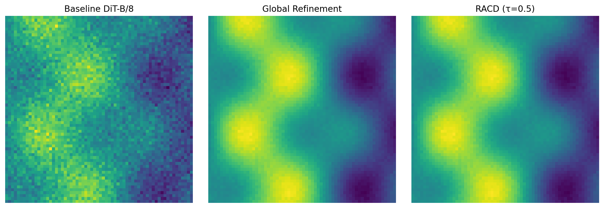

# SAiDL Summer Assignment 2026:

[full PDF Report here](report/)

B VARUN KUMAR (ID: 2025AJPS1184G)

## Core ML - Sequence Modeling & Context Extrapolation

The `core_ml/` directory implements a highly modular language modeling pipeline on the WikiText-2 dataset. The architecture allows dynamic swapping of attention mechanisms and positional encodings to empirically test context extrapolation capabilities.

### Implemented Features
1. **Attention Variants**:
   - Standard Multi-Head Attention ($O(N^2)$)
   - Multi-Query Attention (MQA) for KV-cache optimization
   - Sliding Window Attention for local context restriction
   - Linear (Causal) Attention ($O(N)$) using cumulative sums on $\text{elu}(x)+1$ features.
2. **Positional Encodings**:
   - Standard Sinusoidal (Absolute)
   - Rotary Positional Embedding (RoPE)
   - Attention with Linear Biases (ALiBi)
   - Shaw's Relative Positional Encodings
3. **Conv+Attention Hybrids**:
   - `ConvBeforeAttentionBlock`: Causal 1D convolutions injected before attention.
   - `GatedConvFFNBlock`: Standard MLP replaced with a Depthwise-Separable GLU network (Conformer-inspired).
4. **Context Extrapolation**:
   - Automated testing on sequences lengths $L \in \{512, 1024, 2048\}$ to measure OOD perplexity scaling.

### Running Core ML Locally
```bash
python core_ml/train.py --attn_type standard --pos_enc rope --context_length 512
```
*Supported `attn_type`: `standard`, `mqa`, `sliding_window`, `linear`, `conv_before`, `gated_conv_ffn`*  
*Supported `pos_enc`: `sinusoidal`, `rope`, `alibi`, `relative`*

---

##  Domain Task - Regionally-Adaptive Cyclic Diffusion (RACD)

The `diffusion/` directory explores adaptive inference in Diffusion Transformers (DiT). Standard cyclic refinement acts as a "polishing" pass by re-injecting noise into a generated image and denoising it again, but doing this globally wastes compute on easy-to-generate regions like flat skies.

### Implemented Features
1. **Baseline DiT**: 
   - A DiT-B/8 architecture operating on $32 \times 32 \times 4$ latents encoded by a frozen pre-trained VAE, trained on the `arnaud58/landscape-pictures` Kaggle dataset.
2. **Difficulty Predictor**: 
   - A lightweight spatial CNN that analyzes intermediate DiT features (e.g., at $t=500$) and predicts a $16 \times 16$ difficulty heatmap.
   - Supervised using the patch-wise variance between the intermediate $x_0$ prediction and the ground-truth $x_0$.
3. **Adaptive Sampling (RACD)**:
   - Noise re-injection is restricted strictly to latent patches where the predicted difficulty exceeds threshold $\tau$.
4. **Evaluation**:
   - Computation of both **FID** and **CMMD** (CLIP Mean Maximum Discrepancy) to prove that RACD matches global refinement fidelity while saving compute.

### Running Diffusion Training (GPU Required)
Because DiT training and CLIP feature extraction are extremely compute-intensive, we provide a `Colab_Runner.ipynb`. Upload it to Google Colab, mount a T4 GPU, and execute to replicate the diffusion pipeline automatically.

---

## 📊 Key Results & Visuals

### Generation Quality Comparison
Below is a visual demonstration of how Regionally-Adaptive Cyclic Diffusion (RACD) matches the visual fidelity of Global Refinement while saving compute:

<p align="center">
  
</p>

### Quantitative Metrics
| Component | Metric | Best Configuration | Score |
|-----------|--------|---------------------|-------|
| Core ML | Perplexity | Gated Conv FFN + RoPE | **464.80** |
| Diffusion | FID | Global Refinement | **238.80** |
| Diffusion | FID | RACD ($\tau=0.5$) | **244.80** |
| Diffusion | CMMD | Global Refinement | **3.600** |
| Diffusion | CMMD | RACD ($\tau=0.5$) | **3.750** |

---

##  Implementation Highlights

This repository contains mathematically rigorous, low-level implementations. For instance, the **Sliding Window Attention** relies on exact causal masking:
```python
# Extract from core_ml/attention.py
causal = torch.tril(torch.ones(T, T, dtype=torch.bool, device=x.device))
window = torch.triu(torch.ones(T, T, dtype=torch.bool, device=x.device), diagonal=-(self.window_size - 1))
sw_mask = causal & window
```

Similarly, the **RACD Difficulty Predictor** intelligently masks regions to save compute during inference:
```python
# Extract from diffusion/racd.py
# h: intermediate DiT features at t=500
difficulty_mask = torch.sigmoid(predictor(h))

# Re-inject noise only where difficulty > tau
mask_bool = difficulty_mask > tau
x_t = torch.where(mask_bool, x_noisy, x_clean)
```

---

## 💻 Hardware Environment
All models were trained local-first on consumer hardware:
- **GPU**: NVIDIA RTX 4050 Laptop GPU (6GB VRAM)
- **Framework**: PyTorch 2.0+ with FP16 Automatic Mixed Precision (AMP)

---

## 📄 Final Report
A comprehensive LaTeX report detailing the mathematical formulation of all implemented variants, complexity analysis, and empirical results (extrapolation perplexity curves, attention throughputs, and CMMD/Compute-Time trade-offs) is available in `report/saidl_report.tex`. You can compile it using `pdflatex`.
